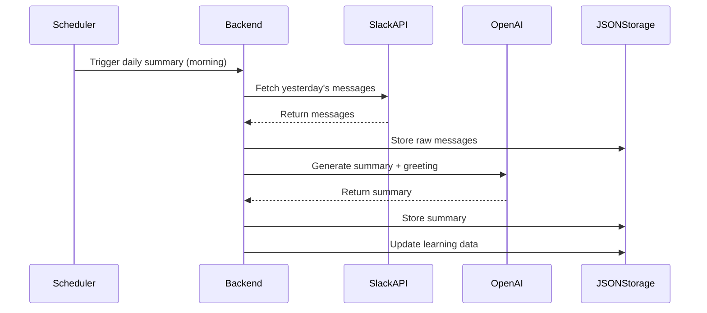

# Newsroom Dashboard - Technical Specifications

## 📊 Project Status Summary

### ✅ **COMPLETED (Phase 1)**
- **Project Structure**: React + Node.js monorepo with TypeScript
- **Authentication**: Slack OAuth integration (backend ready)
- **JSON Storage**: Complete file-based storage system with atomic operations
- **Squad System**: Full squad configuration with hierarchy support
- **Dashboard UI**: Navigation, routing, and squad management interface
- **Deployment**: Vercel, Netlify, and Railway configurations ready
- **Documentation**: Comprehensive setup and deployment guides

### ✅ **COMPLETED (Phase 2 - Message Fetching)**
- **Message Fetching**: Complete Slack message retrieval and processing system
- **Channel Management**: Full channel connection and monitoring features
- **Message Storage**: JSON-based message storage with atomic operations
- **Message Search**: Advanced search and filtering capabilities
- **Message Statistics**: Comprehensive message analytics and stats
- **Frontend Integration**: Complete message management UI with filtering

### 🚧 **IN PROGRESS (Phase 2 - Daily Summaries)**
- **Daily Summaries**: OpenAI integration for daily rundowns

### 📋 **PENDING**
- **Search & Filtering**: Advanced UI features
- **Learning System**: AI optimization and predictions
- **Historical Features**: Analytics and reporting
- **Polish**: Performance and mobile optimization

### 🎯 **NEXT PRIORITY**
Focus on **Phase 2: Data Fetching and Daily Rundown** to complete core functionality.

---

## 📋 Project Overview

The Newsroom Dashboard is a personalized Slack monitoring application designed for product operations managers. It provides AI-powered summaries of Slack activity across relevant channels, with intelligent filtering and learning capabilities. The system generates daily rundowns, enables smart filtering by person/keyword/channel/squad, and learns from user interactions to reduce AI API calls over time.

## 🎯 Core Objectives

1. **Daily Activity Summaries**: Generate AI-powered summaries of yesterday's Slack activity with morning greetings
2. **Smart Filtering**: Enable filtering by person, keyword, channel, or squad with intuitive UI
3. **Learning System**: Reduce AI API calls through learned associations and user tagging
4. **Lightweight Storage**: Efficient JSON-based data management for easy deployment
5. **Expandable Architecture**: Support for future integrations (Notion, etc.)
6. **Quick Deployment**: Web-hostable solution without complex database setup

## 🏗 Architecture Overview

### System Components

```
┌─────────────────┐    ┌─────────────────┐    ┌─────────────────┐
│   React Frontend│    │  Node.js Backend│    │   External APIs │
│                 │    │                 │    │                 │
│ - Dashboard UI  │◄──►│ - API Routes    │◄──►│ - Slack API     │
│ - Filtering     │    │ - Data Processing│   │ - OpenAI API    │
│ - Search        │    │ - Caching       │    │                 │
│ - State Mgmt    │    │ - ML Learning   │    │                 │
│ - Tagging       │    │ - JSON Storage  │    │                 │
└─────────────────┘    └─────────────────┘    └─────────────────┘
                              │
                              ▼
                       ┌─────────────────┐
                       │   JSON Files    │
                       │                 │
                       │ - messages.json │
                       │ - users.json    │
                       │ - channels.json │
                       │ - tags.json     │
                       │ - summaries.json│
                       │ - associations.json│
                       └─────────────────┘
```

## 🛠 Technology Stack

### Frontend
- **Framework**: React 18 with TypeScript
- **Build Tool**: Vite
- **Styling**: Tailwind CSS + Headless UI
- **State Management**: Zustand
- **HTTP Client**: Axios
- **Date Handling**: date-fns
- **Icons**: Heroicons

### Backend
- **Runtime**: Node.js 18+
- **Framework**: Express.js with TypeScript
- **Storage**: JSON files with file system operations
- **Authentication**: JWT tokens with Slack OAuth
- **Rate Limiting**: express-rate-limit
- **Validation**: Zod
- **Logging**: Winston
- **File Operations**: fs-extra for robust JSON handling

### External Services
- **Slack API**: Channel access and message retrieval via @slack/web-api
- **OpenAI API**: GPT-4 for message summarization
- **Environment**: dotenv for configuration

## 📊 Data Models

### Core Entities

```typescript
// Message Entity
interface Message {
  id: string;
  channelId: string;
  userId: string;
  text: string;
  timestamp: Date;
  threadId?: string;
  reactions: Reaction[];
  tags: string[]; // Array of tag names for simplicity
  squad?: string;
  importance?: number; // AI-scored importance (0-1)
  summary?: string; // Cached AI summary
  createdAt: Date;
}

// User Entity
interface User {
  id: string;
  name: string;
  email: string;
  squad?: string;
  role?: string;
  avatar?: string;
  commonTags: string[]; // Learned associations
  createdAt: Date;
}

// Channel Entity
interface Channel {
  id: string;
  name: string;
  squad?: string;
  isPrivate: boolean;
  memberCount: number;
  isConnected: boolean; // User-selected channels
  createdAt: Date;
}

// Tag Entity
interface Tag {
  id: string;
  name: string;
  category: 'keyword' | 'person' | 'squad' | 'custom';
  confidence: number; // 0-1, how reliable this tag is
  usageCount: number;
  createdAt: Date;
  lastUsed: Date;
}

// Summary Entity
interface Summary {
  id: string;
  date: Date;
  channelIds: string[];
  content: string;
  keyTopics: string[];
  participants: string[];
  sentiment: 'positive' | 'neutral' | 'negative';
  aiTokensUsed: number;
  greeting?: string; // Morning greeting text
  highlights: string[]; // High-importance items
  createdAt: Date;
}

// Association Entity (for learning system)
interface Association {
  userId: string;
  commonTags: string[];
  squad?: string;
  lastUpdated: Date;
}
```

## 🔄 Core Workflows

### 1. Daily Summary Generation



### 2. Message Processing Pipeline

1. **Fetch**: Retrieve messages from Slack API using conversations.history
2. **Parse**: Extract metadata and content
3. **Tag**: Apply learned tags and associations (check cache first)
4. **Store**: Save to JSON files with atomic writes
5. **Learn**: Update ML associations based on user interactions
6. **Cache**: Store processed results to minimize API calls

### 3. Learning System

- **Keyword Extraction**: Identify important terms and phrases
- **Person Association**: Link messages to team members via common tags
- **Squad Mapping**: Associate channels with squads
- **Confidence Scoring**: Track tag accuracy over time
- **Usage Analytics**: Monitor tag frequency and user patterns
- **Manual Tagging**: Allow users to tag messages, improving learning

## 🎨 User Interface Design

### Dashboard Layout

```
┌─────────────────────────────────────────────────────────────┐
│ Header: Logo, Date, User Profile, Slack Connection Status  │
├─────────────────────────────────────────────────────────────┤
│ Filters: Date Range, Channels, People, Keywords, Squads    │
├─────────────────────────────────────────────────────────────┤
│ Main Content Area                                          │
│ ┌─────────────────┐ ┌─────────────────┐ ┌─────────────────┐ │
│ │ Daily Rundown   │ │ Activity Feed   │ │ Quick Actions   │ │
│ │                 │ │                 │ │                 │ │
│ │ - Morning Greet │ │ - Recent Msgs   │ │ - Export Data   │ │
│ │ - Key Topics    │ │ - Threads       │ │ - Settings      │ │
│ │ - Highlights    │ │ - Reactions     │ │ - Tag Manager   │ │
│ │ - Participants  │ │ - Tag Buttons   │ │ - Help          │ │
│ └─────────────────┘ └─────────────────┘ └─────────────────┘ │
├─────────────────────────────────────────────────────────────┤
│ Footer: Status, API Usage, Version, Cache Status           │
└─────────────────────────────────────────────────────────────┘
```

### Key UI Components

1. **Daily Rundown Card**: AI-generated morning greeting with yesterday's highlights
2. **Filter Panel**: Multi-select dropdowns with search for person/keyword/channel/squad
3. **Activity Feed**: Message list with expandable threads and tag buttons
4. **Search Bar**: Global search with autocomplete across all data
5. **Tag Manager**: Manual tag creation, editing, and learning visualization
6. **Settings Panel**: Channel connection, API configuration, and preferences
7. **Thread UI**: Expandable thread view with summary generation button

## 🔧 API Endpoints

### Core Endpoints

```typescript
// Authentication
POST   /api/auth/slack-login
POST   /api/auth/logout
GET    /api/auth/me
GET    /api/auth/channels

// Messages
GET    /api/messages
GET    /api/messages/:id
POST   /api/messages/search
GET    /api/messages/summary
GET    /api/messages/yesterday

// Channels
GET    /api/channels
POST   /api/channels/connect
POST   /api/channels/disconnect
GET    /api/channels/:id/messages

// Users
GET    /api/users
GET    /api/users/:id/messages
GET    /api/users/:id/associations

// Tags
GET    /api/tags
POST   /api/tags
PUT    /api/tags/:id
DELETE /api/tags/:id
POST   /api/tags/learn

// Summaries
GET    /api/summaries
POST   /api/summaries/generate
GET    /api/summaries/daily
GET    /api/summaries/:id

// Analytics
GET    /api/analytics/usage
GET    /api/analytics/trends
GET    /api/analytics/cache-stats
```

## 🗄 JSON Storage Schema

### File Structure

```
data/
├── messages.json      # All Slack messages with metadata
├── users.json         # User profiles and associations
├── channels.json      # Channel information and connections
├── tags.json          # Tag definitions and usage stats
├── summaries.json     # Generated summaries and reports
├── associations.json  # Learning data and user patterns
└── cache.json         # API response cache and metadata
```

### JSON File Examples

```json
// messages.json
{
  "messages": [
    {
      "id": "C1234567890.123456",
      "channelId": "C1234567890",
      "userId": "U1234567890",
      "text": "We need to fix the login bug ASAP",
      "timestamp": "2024-01-15T09:30:00Z",
      "threadId": null,
      "reactions": [{"name": "urgent", "count": 3}],
      "tags": ["bug-fix", "urgent", "squad-frontend"],
      "squad": "frontend",
      "importance": 0.9,
      "summary": "Critical login bug requiring immediate attention",
      "createdAt": "2024-01-15T09:30:00Z"
    }
  ],
  "lastUpdated": "2024-01-15T10:00:00Z"
}

// users.json
{
  "users": [
    {
      "id": "U1234567890",
      "name": "John Doe",
      "email": "john@company.com",
      "squad": "frontend",
      "role": "developer",
      "avatar": "https://...",
      "commonTags": ["bug-fix", "frontend", "deployment"],
      "createdAt": "2024-01-01T00:00:00Z"
    }
  ],
  "lastUpdated": "2024-01-15T10:00:00Z"
}

// associations.json
{
  "associations": [
    {
      "userId": "U1234567890",
      "commonTags": ["bug-fix", "frontend", "deployment"],
      "squad": "frontend",
      "lastUpdated": "2024-01-15T10:00:00Z"
    }
  ],
  "learningStats": {
    "totalPredictions": 150,
    "accuratePredictions": 142,
    "accuracy": 0.947
  }
}
```

## 🔐 Security & Authentication

### Authentication Flow

1. **Slack OAuth**: Initial authentication via Slack OAuth 2.0
2. **JWT Tokens**: Session management with refresh tokens
3. **API Rate Limiting**: Prevent abuse and manage OpenAI costs
4. **Environment Variables**: Secure configuration management
5. **File Permissions**: Secure JSON file access

### Security Measures

- HTTPS enforcement
- CORS configuration for web deployment
- Input validation and sanitization with Zod
- XSS protection
- Rate limiting on API endpoints
- Secure file operations with atomic writes
- Environment variable validation

## 📈 Performance Considerations

### Optimization Strategies

1. **JSON Caching**: In-memory caching of frequently accessed data
2. **Pagination**: Limit API response sizes
3. **Lazy Loading**: Load data on demand
4. **Atomic Writes**: Prevent data corruption during file operations
5. **CDN**: Static asset delivery
6. **Compression**: Gzip responses
7. **Batch Operations**: Minimize file I/O operations

### Monitoring

- API response times
- JSON file operation performance
- OpenAI API usage and costs
- Error rates and logging
- User engagement metrics
- Cache hit rates

## 🚀 Deployment Strategy

### Development Environment

- Local development with hot reloading
- Docker containers for consistency
- Environment-specific configurations
- Automated testing pipeline
- JSON file backup and versioning

### Production Environment

- Containerized deployment (Docker)
- Stateless backend with persistent JSON storage
- Load balancing for scalability
- Automated JSON file backups
- Monitoring and alerting
- CI/CD pipeline
- Easy deployment to Vercel, Heroku, or similar platforms

## 🔄 Implementation Phases & Progress

### ✅ Phase 1: Setup and Basics (COMPLETED)
- [x] Set up project structure with React + Node.js
- [x] Integrate Slack API with OAuth flow (backend ready)
- [x] Implement basic JSON storage system
- [x] Create dashboard skeleton with navigation
- [x] Add channel connection functionality (UI ready)
- [x] **BONUS**: Complete squad configuration system
- [x] **BONUS**: Squad hierarchy management
- [x] **BONUS**: Deployment configuration (Vercel, Netlify)

### ✅ Phase 2: Data Fetching and Daily Rundown (COMPLETED - Message Fetching)
**Status: COMPLETED - Message Fetching System**

#### Message Fetching System ✅
- [x] Implement message controllers and routes
- [x] Create message processing pipeline
- [x] Add Slack message fetching endpoints
- [x] Implement message storage and retrieval
- [x] Add message search and filtering
- [x] Add message statistics and analytics

#### Channel Management ✅
- [x] Implement channel connection/disconnection
- [x] Add channel status monitoring
- [x] Create channel filtering and search
- [x] Add channel analytics
- [x] Implement channel refresh from Slack

#### Frontend Integration ✅
- [x] Create MessageList component with filtering
- [x] Add channel management UI
- [x] Implement message search functionality
- [x] Add date range filtering
- [x] Create message display with tags and metadata

### 🚧 Phase 2: Daily Summary Generation (IN PROGRESS)
**Priority: HIGH - Next Development Focus**

#### Daily Summary Generation
- [ ] Connect OpenAI service to message processing
- [ ] Implement daily summary generation endpoints
- [ ] Create summary scheduling system
- [ ] Add summary storage and display
- [ ] Generate morning greeting and highlights

### 📋 Phase 3: Sorting, Filtering, and UI (PENDING)
- [ ] Implement sorting/filtering by person/keyword/channel/squad
- [ ] Add thread UI with expandable replies
- [ ] Create search functionality
- [ ] Build tag management interface
- [ ] Add manual tagging capabilities

### 📋 Phase 4: Learning and Optimization (PENDING)
- [ ] Implement learning system for tag associations
- [ ] Add confidence scoring and usage analytics
- [ ] Optimize AI calls with caching
- [ ] Build user association profiles
- [ ] Add prediction system for automatic tagging

### 📋 Phase 5: Search and Historical Features (PENDING)
- [ ] Implement historical search functionality
- [ ] Add monthly/weekly summary generation
- [ ] Create export features (CSV, JSON)
- [ ] Build analytics dashboard
- [ ] Add performance monitoring

### 📋 Phase 6: Polish and Future Prep (PENDING)
- [ ] Add Notion integration preparation
- [ ] Implement advanced analytics
- [ ] Add mobile responsiveness
- [ ] Performance optimization
- [ ] Comprehensive testing
- [ ] Documentation and deployment guides

## 🎯 Next Development Priorities

### Immediate Next Steps (Choose One)
1. **Daily Summary Generation** - Connect OpenAI and create daily rundowns
2. **Advanced Filtering** - Implement sorting/filtering by person/keyword/channel/squad
3. **Learning System** - Add AI optimization and prediction features

### Current Status
- ✅ **Foundation Complete**: Squad system, authentication, deployment ready
- ✅ **Message Fetching Complete**: Full message retrieval, storage, and search system
- ✅ **Channel Management Complete**: Connection, monitoring, and analytics
- 🚧 **Core Features**: Daily summaries with OpenAI integration needed
- 📋 **UI/UX**: Advanced filtering and search features pending
- 📋 **Learning System**: AI optimization and prediction features pending

## 🔄 Future Enhancements

### Phase 2 Features

1. **Notion Integration**: Pull weekly notes and generate combined reports
2. **Advanced Analytics**: Trend analysis and predictive insights
3. **Team Collaboration**: Shared dashboards and annotations
4. **Mobile App**: React Native companion app
5. **Webhooks**: Real-time updates from Slack
6. **Export Features**: PDF reports, CSV data export
7. **Advanced Learning**: ML model for better predictions

### Technical Debt

- Comprehensive test coverage
- Performance optimization
- Code documentation
- Security audit
- Accessibility compliance
- Database migration path (if needed for scale)

## 📋 Development Guidelines

### Code Standards

- TypeScript strict mode
- ESLint + Prettier configuration
- Conventional commits
- Branch naming conventions
- Pull request templates
- JSON schema validation

### Testing Strategy

- Unit tests for business logic
- Integration tests for API endpoints
- E2E tests for critical user flows
- Performance testing
- Security testing
- JSON file integrity testing

### Documentation

- API documentation (OpenAPI/Swagger)
- Component documentation (Storybook)
- JSON schema documentation
- Deployment guides
- Troubleshooting guides
- Learning system documentation

## 🎯 Key Advantages of JSON Storage

1. **Easy Deployment**: No database setup required, works on any web host
2. **Simple Backup**: Just copy JSON files for backup/restore
3. **Version Control**: JSON files can be version controlled
4. **Portability**: Easy to move between environments
5. **Transparency**: Human-readable data format
6. **Atomic Operations**: File-level atomicity for data integrity
7. **Scalability Path**: Can migrate to database later if needed

## ⚠️ JSON Storage Considerations

1. **Concurrency**: Single-writer pattern for file operations
2. **Performance**: In-memory caching for frequently accessed data
3. **Size Limits**: Monitor file sizes and implement archiving
4. **Backup Strategy**: Regular automated backups
5. **Migration Path**: Design for easy database migration if needed
