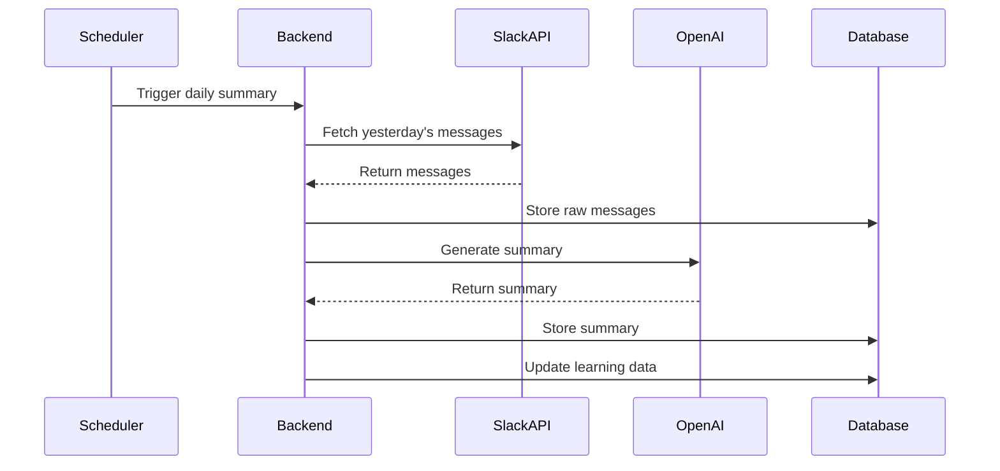

# Newsroom Dashboard - Technical Specifications

## 📋 Project Overview

The Newsroom Dashboard is a personalized Slack monitoring application designed for product operations managers. It provides AI-powered summaries of Slack activity across relevant channels, with intelligent filtering and learning capabilities.

## 🎯 Core Objectives

1. **Daily Activity Summaries**: Generate AI-powered summaries of yesterday's Slack activity
2. **Smart Filtering**: Enable filtering by person, keyword, channel, or squad
3. **Learning System**: Reduce AI API calls through learned associations
4. **Lightweight Storage**: Efficient local data management
5. **Expandable Architecture**: Support for future integrations

## 🏗 Architecture Overview

### System Components

```
┌─────────────────┐    ┌─────────────────┐    ┌─────────────────┐
│   React Frontend│    │  Node.js Backend│    │   External APIs │
│                 │    │                 │    │                 │
│ - Dashboard UI  │◄──►│ - API Routes    │◄──►│ - Slack API     │
│ - Filtering     │    │ - Data Processing│   │ - OpenAI API    │
│ - Search        │    │ - Caching       │    │                 │
│ - State Mgmt    │    │ - ML Learning   │    │                 │
└─────────────────┘    └─────────────────┘    └─────────────────┘
                              │
                              ▼
                       ┌─────────────────┐
                       │   SQLite DB     │
                       │                 │
                       │ - Messages      │
                       │ - Tags          │
                       │ - Associations  │
                       │ - Cache         │
                       └─────────────────┘
```

## 🛠 Technology Stack

### Frontend
- **Framework**: React 18 with TypeScript
- **Build Tool**: Vite
- **Styling**: Tailwind CSS + Headless UI
- **State Management**: Zustand
- **HTTP Client**: Axios
- **Date Handling**: date-fns
- **Icons**: Heroicons

### Backend
- **Runtime**: Node.js 18+
- **Framework**: Express.js with TypeScript
- **Database**: SQLite with Prisma ORM
- **Authentication**: JWT tokens
- **Rate Limiting**: express-rate-limit
- **Validation**: Zod
- **Logging**: Winston

### External Services
- **Slack API**: Channel access and message retrieval
- **OpenAI API**: GPT-4 for message summarization
- **Environment**: dotenv for configuration

## 📊 Data Models

### Core Entities

```typescript
// Message Entity
interface Message {
  id: string;
  channelId: string;
  userId: string;
  text: string;
  timestamp: Date;
  threadId?: string;
  reactions: Reaction[];
  tags: Tag[];
  squad?: string;
}

// User Entity
interface User {
  id: string;
  name: string;
  email: string;
  squad?: string;
  role?: string;
  avatar?: string;
}

// Channel Entity
interface Channel {
  id: string;
  name: string;
  squad?: string;
  isPrivate: boolean;
  memberCount: number;
}

// Tag Entity
interface Tag {
  id: string;
  name: string;
  category: 'keyword' | 'person' | 'squad' | 'custom';
  confidence: number;
  usageCount: number;
}

// Summary Entity
interface Summary {
  id: string;
  date: Date;
  channelIds: string[];
  content: string;
  keyTopics: string[];
  participants: string[];
  sentiment: 'positive' | 'neutral' | 'negative';
  aiTokensUsed: number;
}
```

## 🔄 Core Workflows

### 1. Daily Summary Generation



### 2. Message Processing Pipeline

1. **Fetch**: Retrieve messages from Slack API
2. **Parse**: Extract metadata and content
3. **Tag**: Apply learned tags and associations
4. **Store**: Save to local database
5. **Learn**: Update ML associations
6. **Cache**: Store processed results

### 3. Learning System

- **Keyword Extraction**: Identify important terms and phrases
- **Person Association**: Link messages to team members
- **Squad Mapping**: Associate channels with squads
- **Confidence Scoring**: Track tag accuracy
- **Usage Analytics**: Monitor tag frequency

## 🎨 User Interface Design

### Dashboard Layout

```
┌─────────────────────────────────────────────────────────────┐
│ Header: Logo, Date, User Profile                           │
├─────────────────────────────────────────────────────────────┤
│ Filters: Date Range, Channels, People, Keywords            │
├─────────────────────────────────────────────────────────────┤
│ Main Content Area                                          │
│ ┌─────────────────┐ ┌─────────────────┐ ┌─────────────────┐ │
│ │ Summary Cards   │ │ Activity Feed   │ │ Quick Actions   │ │
│ │                 │ │                 │ │                 │ │
│ │ - Daily Summary │ │ - Recent Msgs   │ │ - Export Data   │ │
│ │ - Key Topics    │ │ - Threads       │ │ - Settings      │ │
│ │ - Participants  │ │ - Reactions     │ │ - Help          │ │
│ └─────────────────┘ └─────────────────┘ └─────────────────┘ │
├─────────────────────────────────────────────────────────────┤
│ Footer: Status, API Usage, Version                         │
└─────────────────────────────────────────────────────────────┘
```

### Key UI Components

1. **Summary Cards**: AI-generated insights with expandable details
2. **Filter Panel**: Multi-select dropdowns with search
3. **Activity Feed**: Real-time message stream
4. **Search Bar**: Global search with autocomplete
5. **Tag Manager**: Manual tag creation and editing
6. **Settings Panel**: Configuration and preferences

## 🔧 API Endpoints

### Core Endpoints

```typescript
// Authentication
POST   /api/auth/login
POST   /api/auth/logout
GET    /api/auth/me

// Messages
GET    /api/messages
GET    /api/messages/:id
POST   /api/messages/search
GET    /api/messages/summary

// Channels
GET    /api/channels
GET    /api/channels/:id/messages

// Users
GET    /api/users
GET    /api/users/:id/messages

// Tags
GET    /api/tags
POST   /api/tags
PUT    /api/tags/:id
DELETE /api/tags/:id

// Summaries
GET    /api/summaries
POST   /api/summaries/generate
GET    /api/summaries/:id

// Analytics
GET    /api/analytics/usage
GET    /api/analytics/trends
```

## 🗄 Database Schema

### Tables

```sql
-- Messages table
CREATE TABLE messages (
  id TEXT PRIMARY KEY,
  channel_id TEXT NOT NULL,
  user_id TEXT NOT NULL,
  text TEXT NOT NULL,
  timestamp DATETIME NOT NULL,
  thread_id TEXT,
  squad TEXT,
  created_at DATETIME DEFAULT CURRENT_TIMESTAMP
);

-- Users table
CREATE TABLE users (
  id TEXT PRIMARY KEY,
  name TEXT NOT NULL,
  email TEXT,
  squad TEXT,
  role TEXT,
  avatar TEXT,
  created_at DATETIME DEFAULT CURRENT_TIMESTAMP
);

-- Channels table
CREATE TABLE channels (
  id TEXT PRIMARY KEY,
  name TEXT NOT NULL,
  squad TEXT,
  is_private BOOLEAN DEFAULT FALSE,
  member_count INTEGER DEFAULT 0,
  created_at DATETIME DEFAULT CURRENT_TIMESTAMP
);

-- Tags table
CREATE TABLE tags (
  id INTEGER PRIMARY KEY AUTOINCREMENT,
  name TEXT NOT NULL UNIQUE,
  category TEXT NOT NULL,
  confidence REAL DEFAULT 0.0,
  usage_count INTEGER DEFAULT 0,
  created_at DATETIME DEFAULT CURRENT_TIMESTAMP
);

-- Message tags junction table
CREATE TABLE message_tags (
  message_id TEXT NOT NULL,
  tag_id INTEGER NOT NULL,
  confidence REAL DEFAULT 1.0,
  created_at DATETIME DEFAULT CURRENT_TIMESTAMP,
  PRIMARY KEY (message_id, tag_id),
  FOREIGN KEY (message_id) REFERENCES messages(id),
  FOREIGN KEY (tag_id) REFERENCES tags(id)
);

-- Summaries table
CREATE TABLE summaries (
  id INTEGER PRIMARY KEY AUTOINCREMENT,
  date DATE NOT NULL,
  channel_ids TEXT NOT NULL, -- JSON array
  content TEXT NOT NULL,
  key_topics TEXT, -- JSON array
  participants TEXT, -- JSON array
  sentiment TEXT,
  ai_tokens_used INTEGER DEFAULT 0,
  created_at DATETIME DEFAULT CURRENT_TIMESTAMP
);
```

## 🔐 Security & Authentication

### Authentication Flow

1. **Slack OAuth**: Initial authentication via Slack
2. **JWT Tokens**: Session management with refresh tokens
3. **API Rate Limiting**: Prevent abuse and manage costs
4. **Environment Variables**: Secure configuration management

### Security Measures

- HTTPS enforcement
- CORS configuration
- Input validation and sanitization
- SQL injection prevention (Prisma ORM)
- XSS protection
- Rate limiting on API endpoints

## 📈 Performance Considerations

### Optimization Strategies

1. **Caching**: Redis for frequently accessed data
2. **Pagination**: Limit API response sizes
3. **Lazy Loading**: Load data on demand
4. **Indexing**: Database indexes for common queries
5. **CDN**: Static asset delivery
6. **Compression**: Gzip responses

### Monitoring

- API response times
- Database query performance
- OpenAI API usage and costs
- Error rates and logging
- User engagement metrics

## 🚀 Deployment Strategy

### Development Environment

- Local development with hot reloading
- Docker containers for consistency
- Environment-specific configurations
- Automated testing pipeline

### Production Environment

- Containerized deployment (Docker)
- Load balancing for scalability
- Database backups and recovery
- Monitoring and alerting
- CI/CD pipeline

## 🔄 Future Enhancements

### Phase 2 Features

1. **Notion Integration**: Pull weekly notes and generate combined reports
2. **Advanced Analytics**: Trend analysis and predictive insights
3. **Team Collaboration**: Shared dashboards and annotations
4. **Mobile App**: React Native companion app
5. **Webhooks**: Real-time updates from Slack
6. **Export Features**: PDF reports, CSV data export

### Technical Debt

- Comprehensive test coverage
- Performance optimization
- Code documentation
- Security audit
- Accessibility compliance

## 📋 Development Guidelines

### Code Standards

- TypeScript strict mode
- ESLint + Prettier configuration
- Conventional commits
- Branch naming conventions
- Pull request templates

### Testing Strategy

- Unit tests for business logic
- Integration tests for API endpoints
- E2E tests for critical user flows
- Performance testing
- Security testing

### Documentation

- API documentation (OpenAPI/Swagger)
- Component documentation (Storybook)
- Database schema documentation
- Deployment guides
- Troubleshooting guides
